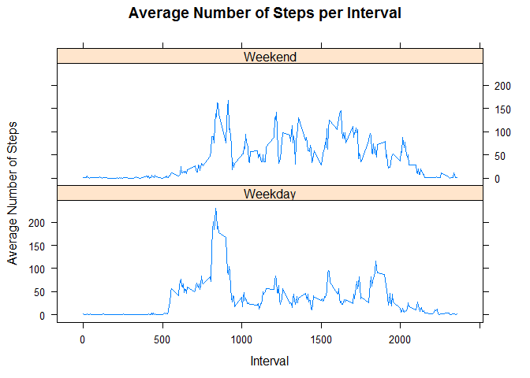

# Reproducible Research: Peer Assessment 1


## Loading and preprocessing the data

```r
unzip("activity.zip")  
data <- read.csv("activity.csv")
```


## What is mean total number of steps taken per day?

```r
completedata <- data[complete.cases(data), ]  
stepsperday <- aggregate(completedata$steps, by=list(date=completedata$date), FUN=sum)  

hist(stepsperday$x, xlab = "Steps per Day", main = "Number of Steps per Day")   
```

 

```r
meansteps<- format(round(mean(stepsperday$x), 2), nsmall = 2)
mediansteps <- median(stepsperday$x)
```

The mean total number of steps taken per day is **10766.19**.  
The median is **10765**.  


## What is the average daily activity pattern?

```r
stepsperinterval <- aggregate(completedata$steps, by=list(interval=completedata$interval), FUN=mean)

with(stepsperinterval, plot(interval, x, type = "l"  
        , xlab = "Interval", ylab = "Average Number of Steps", main = "Average Number of Steps per Interval"))
```

 

```r
maxsteps <- stepsperinterval[stepsperinterval$x == max(stepsperinterval$x), ]
```

The 5-minute interval containing the maximum number of steps is **835**.


## Imputing missing values

```r
missingrows <- nrow(data) - nrow(completedata)
missingdata <- data[!complete.cases(data), ] 

filledmissingdata <- merge(missingdata, stepsperinterval, by.x = "interval", by.y = "interval")
filledmissingdata <- filledmissingdata[,c("x", "date", "interval")]
names(filledmissingdata)[1] <- c("steps")

alldata <- rbind(completedata, filledmissingdata)
alldata <- alldata[order(alldata$date, alldata$interval),]
allstepsperday <- aggregate(alldata$steps, by=list(date=alldata$date), FUN=sum)  

hist(allstepsperday$x, xlab = "Steps per Day", main = "Number of Steps per Day")
```

 

```r
meanallsteps<- format(round(mean(allstepsperday$x), 2), nsmall = 2)
medianallsteps <- format(round(median(allstepsperday$x), 2), nsmall = 2)
```

Total number of rows with missing data is 2304.

In order to fill in the missing values, the previously calculated average number of steps per interval across days was used. In this manner, all the 2304 rows with missing steps were given a relatively accurate value **without affecting** the total mean of the pre-populated data.

The mean total number of steps taken per day, after adding the missing data, is **10766.19**.  
The median, after adding the missing data, is **10766.19**. 


## Are there differences in activity patterns between weekdays and weekends?

```r
alldata$wkdy <- weekdays(as.Date(alldata$date))
alldata$typeofday <- as.factor(ifelse(alldata$wkdy %in% c("Saturday","Sunday"), "Weekend", "Weekday")) 

allstepsperinterval <- aggregate(alldata$steps, by=list(typeofday=alldata$typeofday, Interval=alldata$interval), FUN=mean)

library(lattice)
xyplot(x ~ Interval | typeofday, data = allstepsperinterval, type='l', layout = c(1, 2)
       , xlab = "Interval", ylab = "Average Number of Steps", main = "Average Number of Steps per Interval")
```

 
